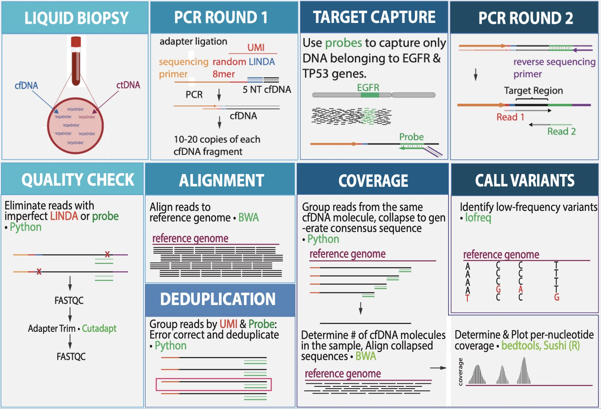

# Cancer detection by genomic analysis of cell-free DNA 

## Project Members: Sneha Challa1, Nora Kearns1, Thomas Persse1, Dr. Chris Raymond, PhD2
 ---

### Project Goal:
We sought to create a portable bioinformatic pipeline for performing variant calling on cell free DNA (cfDNA) collected from liquid biopsies, with an end goal of detecting recurrent cancer.

### Workflow: 
 ---
|  |
|:--:|
| <b>Overall project workflow, from molecular biology to bioinformatic approach used. </b>|

cfDNA is extracted via liquid biopsy, then prepped via the addition of UMI (clone id + LINDA (sample id)), and targeted via 40nt probe sequences. This is then sequenced via Illumina paired-end short read sequencing (151x151nt). Our first step is quality assessment, during which reads with imperfect LINDA and/or probe sequences were eliminated, then adapters were trimmed. Remaining reads were then aligned to the ensembl reference human genome via **bwa mem**, then deduplicated and error corrected using an in house python script (). Coverage was determined by generating consensus cfDNA fragments from the reads, then determining the number of fragments per position within EGFR and TP53. Finally, variant calling was performed using lofreq. Software incorporated into final pipeline is indicated in green.

### Acknowledgements
 ---
A special thank you to everyone at Salish Biosciences and the University of Oregon Bioinformatics and Genomics Track for the opportunities, assistance, and guidance throughout this project.

This work benefited from access to the University of Oregon high performance computing cluster, Talapas.
